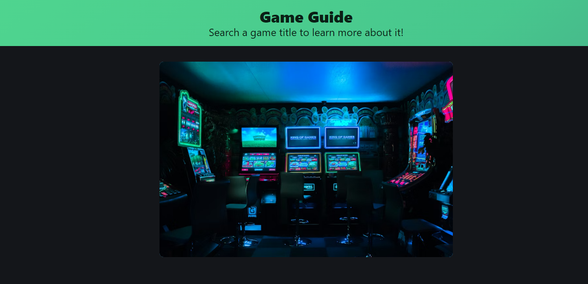
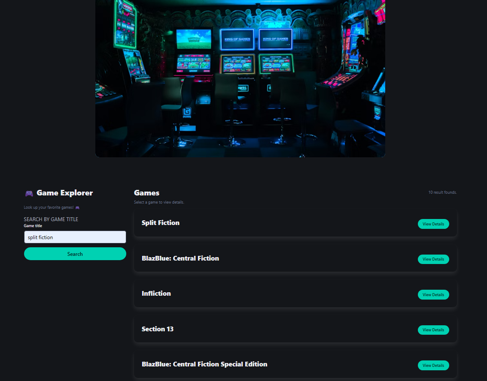

# Project 1: Game Guide

## Description
A web application that allows users to search for video games, view detailed critic information, and watch official game trailers

This project uses the OpenCritic API for game data and the YouTube Data API for video trailers

## Features
- 🔍 Search for any game
- 📄 View detailed game info
- 🎞️ YouTube Trailer Integration
- 🔙 Back to results
- 🎨 Clean UI built with Bulma

## Screenshot

## Technologies Used
- HTML5
- CSS3
- JavaScript
- OpenCritic API
- YouTube Data API v3
- Unsplash

## Folder Structure

/project-root
│
├── index.html
├── README.md
│
├── assets/
│   ├── css/
│   │   └── styles.css
│   └── js/
│       └── script.js
│
└── images/ (optional)

## API Keys

This project utilizes 2 APIs
1. OpenCritic (via RapidAPI)
2. YouTube Data API v3 

## 🧪 How It Works
1. User searches for a game
2. User picks a result
3. Trailer search occurs
4. UI renders a card with:
    -   Text information (left)
    -   Image (right)
    -   Trailer (below text)

## Future Enhancements
- Add favorite games list
- Add New Releases list
- Add game screenshot carousel
- Best Deal finder

## Resources
- MDN Docs
- W3Schools
- API Documentation

## Contact
Created by **Jean Park**  
- LinkedIn: https://www.linkedin.com/in/<your-profile>  
- Email: thejeanpark@gmail.com